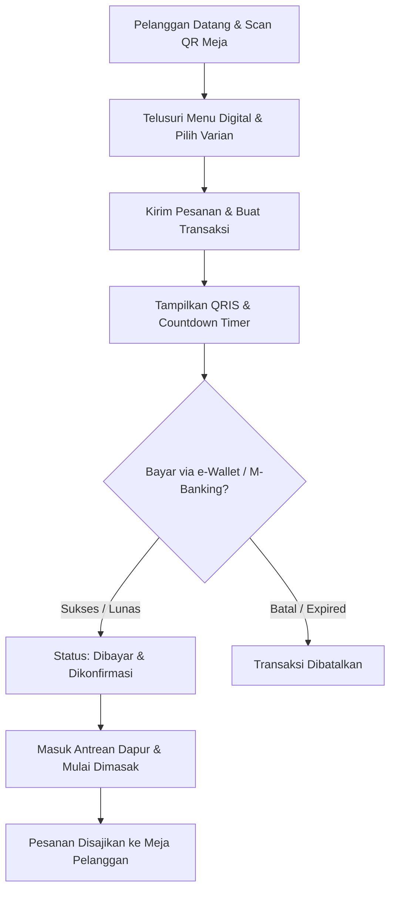
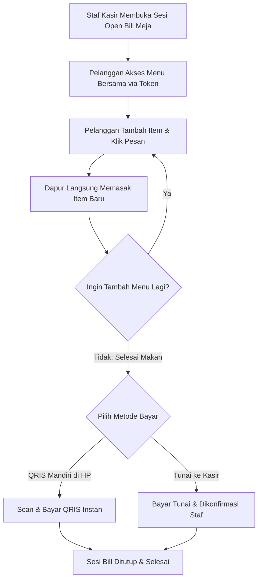

# 🍽️ Santap API: Seluler Mandiri & Transaksi Meja Cepat

Santap adalah platform teknologi F&B modern yang dirancang khusus untuk menciptakan pengalaman makan di tempat (*dine-in*) yang mulus, cepat, dan menyenangkan bagi pelanggan Anda. Melalui integrasi pemesanan mandiri berbasis QR meja, sistem pembayaran QRIS otomatis, dan transparansi status pesanan dapur secara *real-time*, Santap mengeliminasi antrean serta waktu tunggu yang tidak perlu.

---

## ✨ Pilar Utama Pengalaman Pelanggan (Customer Experience)

Sistem backend Santap mendukung empat pilar utama pengalaman pelanggan:

### 1. 📱 Scan QR & Pesan Mandiri (Table Order)
Pelanggan tidak perlu lagi menunggu pelayan datang membawa menu fisik. Cukup dengan memindai kode QR unik yang ada di meja:
* **Menu Digital Interaktif**: Menelusuri seluruh menu makanan dan minuman secara visual langsung dari browser handphone.
* **Kustomisasi Hidangan**: Menyesuaikan pilihan rasa, tingkat kepedasan, ukuran porsi, atau tambahan *topping* sesuai keinginan.
* **Instan & Tanpa Antrean**: Pesanan terkirim secara otomatis ke sistem dapur setelah pembayaran terverifikasi.

### 2. 💳 Pembayaran Instan Berbasis QRIS
Santap mengintegrasikan gerbang pembayaran digital untuk mempermudah transaksi:
* **QRIS Dinamis Otomatis**: Setiap transaksi akan menghasilkan kode QRIS unik beserta penghitung waktu mundur (*countdown timer*).
* **Kompatibilitas Luas**: Dapat dibayar menggunakan berbagai aplikasi *mobile banking* dan dompet digital populer (GoPay, OVO, Dana, ShopeePay, LinkAja, dll.).
* **Verifikasi Otomatis Tanpa Bukti Transfer**: Pembayaran divalidasi langsung oleh sistem. Status pesanan pelanggan langsung berubah menjadi terkonfirmasi secara instan.

### 3. 👥 Sesi Meja Bersama (Open Bill / Dine-in Tab)
Untuk pelanggan yang makan berkelompok atau ingin menambah pesanan secara fleksibel sepanjang sesi makan mereka:
* **Sesi Terbuka Bersama**: Kasir atau staf dapat membuat sesi *Open Bill* untuk meja terkait, dan membagikan token akses digital.
* **Pemesanan Mandiri Berulang (Repeat Order)**: Siapa saja di meja tersebut dapat menambahkan menu baru ke bill yang sama dari handphone masing-masing tanpa harus menutup tagihan terlebih dahulu.
* **Dapur Langsung Memasak**: Setiap tambahan menu baru akan langsung masuk ke antrean dapur secara otomatis.
* **Metode Pelunasan Fleksibel**: Pembayaran bill bersama dapat dilunasi secara mandiri via QRIS atau secara tunai di kasir pada akhir kunjungan.

### 4. 👩‍🍳 Transparansi Proses Dapur & Layanan
Menghilangkan rasa cemas menunggu makanan dengan memberikan status penyiapan yang transparan:
* **Pelacakan Real-Time**: Pelanggan dapat memantau status setiap item pesanan mereka.
* **Tahapan Status Pesanan**:
  * 📥 **Pending**: Menunggu pembayaran atau verifikasi kasir.
  * 🍳 **Preparing**: Pesanan sedang dipersiapkan dan dimasak oleh koki di dapur.
  * 🍽️ **Ready**: Hidangan telah selesai dimasak dan siap disajikan.
  * 🚚 **Served**: Hidangan telah diantarkan ke meja pelanggan.

---

## 🗺️ Alur Perjalanan Pelanggan (Customer Journey Maps)

Berikut adalah visualisasi alur interaksi pelanggan dengan sistem Santap:

### 1. Alur Pemesanan Mandiri & Pembayaran QRIS Instan

### 2. Alur Makan Bersama (Sesi Open Bill)

---

## 🛠️ Catatan Teknis (Untuk Pengembang & Staf Sistem)

Untuk detail teknis, konfigurasi server, arsitektur backend, dan integrasi API pengembang, silakan merujuk pada:
* 📄 **Catatan Perubahan Arsitektur**: [Update.md](file:///c:/laragon/www/api-santap/Update.md)
* 📁 **Direktori Rute API**: [routes/api.php](file:///c:/laragon/www/api-santap/routes/api.php)
* 📁 **Dokumentasi API Tambahan**: [docs/](file:///c:/laragon/www/api-santap/docs/)
