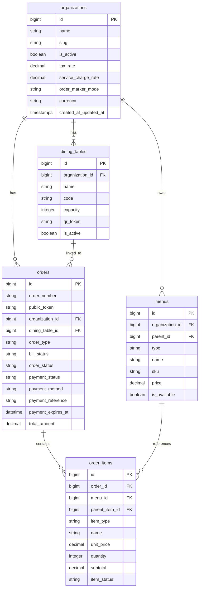

# Catatan Pembaruan & Verifikasi Arsitektur (Update.md)

Dokumen ini mencatat bahwa **tidak ada perubahan atau modifikasi kode sumber (source code)** yang dilakukan pada repositori backend **Santap** selama sesi analisis ini. Semua berkas kode backend berada dalam kondisi bersih (*working tree clean*).

Sesi ini hanya difokuskan untuk membaca dan memverifikasi alur sistem untuk kebutuhan pembuatan diagram **Bab III Laporan Magang**.

---

## 🔍 Berkas yang Diverifikasi
Berikut adalah daftar berkas backend utama yang dianalisis untuk memastikan keakuratan diagram alur:
1. **Routing**: [routes/api.php](file:///c:/laragon/www/api-santap/routes/api.php)
2. **Controllers**:
   - [CustomerController.php](file:///c:/laragon/www/api-santap/app/Http/Controllers/Api/V1/CustomerController.php) (Alur pemesanan pelanggan & integrasi QRIS)
   - [CashierOrderController.php](file:///c:/laragon/www/api-santap/app/Http/Controllers/Api/V1/CashierOrderController.php) (Aksi kasir/staff)
3. **Middleware**:
   - [EnsureCustomerToken.php](file:///c:/laragon/www/api-santap/app/Http/Middleware/EnsureCustomerToken.php) (Autentikasi sesi open bill pelanggan)
4. **Models**:
   - [Order.php](file:///c:/laragon/www/api-santap/app/Models/Order.php) (Daur hidup & state mesin order)
   - [OrderItem.php](file:///c:/laragon/www/api-santap/app/Models/OrderItem.php) (Status item pesanan)
5. **Services**:
   - [OrderQrisPaymentService.php](file:///c:/laragon/www/api-santap/app/Services/OrderQrisPaymentService.php) (Logika transaksi QRIS)

---

## 📊 Diagram Terverifikasi untuk Laporan Magang
Anda dapat menyalin kode Mermaid di bawah ke editor Markdown Anda:

### 1. Flow Customer Order (Table Order)
```mermaid
flowchart TD
    A[Pelanggan Scan QR Meja] --> B[GET /customer/table/{qrToken}]
    B --> C[Frontend Dapatkan ID Organisasi & Meja]
    C --> D[GET /customer/menu?org={id}]
    D --> E[Pelanggan Pilih Menu & Opsi/Varian]
    E --> F[Kirim Pesanan: POST /customer/order]
    
    subgraph DB_Transaction [Transaksi Database - createOrder]
        F --> G[Buat Data Order di Tabel orders <br/> order_type=table_order, bill_status=none, <br/> order_status=pending, payment_status=pending]
        G --> H[Simpan Detail Item di Tabel order_items]
        H --> I[Panggil API Payment Gateway <br/> create QRIS Transaction]
        I --> J[Simpan payment_reference & payment_expires_at]
    end
    
    J --> K[Broadcast Event: OrderPlaced ke Dashboard Staff]
    K --> L[Tampilkan QRIS & Countdown Timer di Frontend]
    
    L --> M{Pelanggan Bayar? <br/> Polling GET /customer/orders/{id}/payment-status}
    M -->|Ya: Settlement| N[markPaid: payment_status=paid, <br/> order_status=confirmed]
    M -->|Tidak: Timeout/Cancel| O[markPaymentExpired: payment_status=cancelled, <br/> order_status=cancelled]
    
    N --> P[Broadcast Event: OrderPaid]
    P --> Q[Masuk ke Antrean Dapur <br/> Staff Dapur memajukan status item: <br/> Pending -> Preparing -> Ready -> Served]
```

### 2. Flow Open Bill
```mermaid
flowchart TD
    A[Staf/Kasir Membuat Sesi Open Bill <br/> POST /cashier/orders] --> B[Sesi Open Bill Aktif <br/> bill_status=open, order_status=pending, <br/> payment_status=unpaid, token di-share]
    B --> C[Pelanggan Akses Menu via Token <br/> GET /customer/order dengan X-Public-Token]
    
    C --> D[Pelanggan Tambah Item Baru <br/> POST /customer/order/items]
    D --> E[Sistem validasi & update total Order <br/> Recalculate financial fields]
    E --> F[Broadcast Event: OpenBillRepeatOrderCreated]
    F --> G[Dapur Langsung Memasak Item Baru]
    
    G --> H{Mau Tambah Lagi?}
    H -->|Ya| D
    H -->|Tidak: Ingin Bayar| I{Pilih Metode Pembayaran}
    
    I -->|QRIS Mandiri Pelanggan| J[POST /customer/order/pay-qris]
    J --> K[QRIS Dibuat, status order dikunci <br/> payment_status=pending]
    K --> L{Polling Status: <br/> GET /customer/order/qris-status}
    L -->|Lunas| M[markPaid: payment_status=paid, <br/> bill_status=closed, closed_at=now()]
    L -->|Expired/Cancel| N[Buka Kunci Order: <br/> payment_status=unpaid]
    N --> D
    
    I -->|Tunai/Cash di Kasir| O[Kasir POST /cashier/orders/{id}/pay-cash]
    O --> P[Kasir Terima Uang & Hitung Kembalian]
    P --> Q[Sistem Update: payment_status=paid, <br/> bill_status=closed, closed_at=now()]
```

### 3. ERD (Entity Relationship Diagram)

