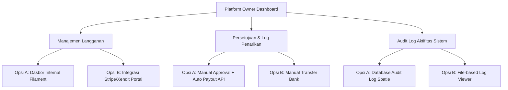
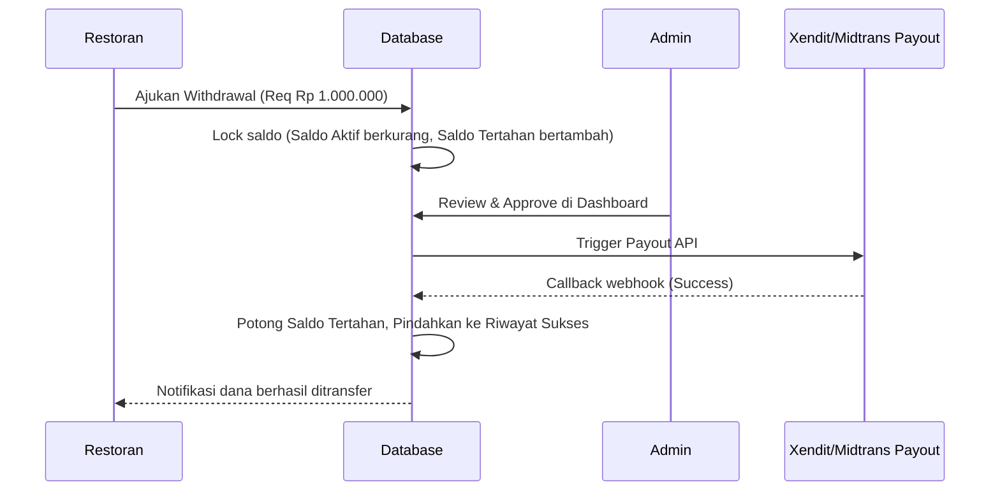
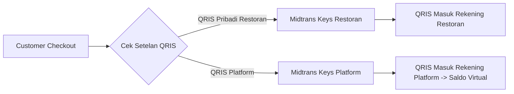
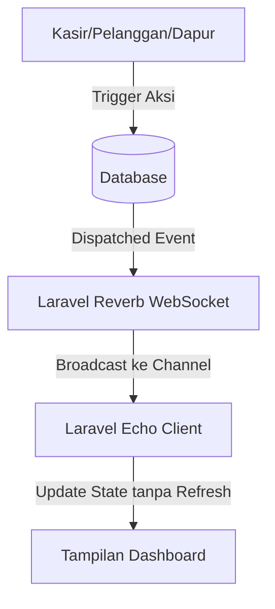

# Dokumentasi Solusi & Peta Jalan Fitur Urgen Santap

Dokumen ini memetakan solusi, alur penanganan, serta perbandingan opsi arsitektur untuk fitur-fitur baru dan isu teknis di platform **Santap**.

---

## 1. Dasbor Owner (Santap Platform Owner)

Sebagai pemilik platform Santap, Anda membutuhkan visibilitas menyeluruh terhadap performa bisnis, aliran dana, dan audit sistem.

### 1.1. Melihat Informasi Langganan (Subscriptions)
Melihat data organisasi aktif, tipe paket (Basic, Pro, Enterprise), status billing, dan MRR (Monthly Recurring Revenue).

| Aspek | Opsi A: Dasbor Internal (Filament Custom Page) [Direkomendasikan] | Opsi B: Integrasi Portal Merchant (Stripe/Xendit Billing) |
| :--- | :--- | :--- |
| **Deskripsi** | Membuat halaman manajemen langganan di Panel Admin Filament. Mengambil data langsung dari tabel `subscriptions`. | Mengarahkan owner ke portal dashboard payment gateway (Stripe Billing/Xendit recurring). |
| **Alur Kerja** | Owner masuk ke Filament -> Pilih menu **Subscriptions** -> Melihat tabel berisi: Nama Restoran, Paket, Tanggal Berakhir, Status, serta grafik pendapatan langganan bulanan. | Owner masuk ke dashboard Xendit -> Buka menu **Recurring Payments** -> Melihat data tagihan dan status langganan. |
| **Kelebihan** | - Data menyatu dengan data operasional restoran. - Bisa melakukan action langsung (misal: memberikan diskon, suspend langganan). | - Tanpa perlu coding dasbor di Laravel. - Fitur invoicing dan dunning otomatis dari penyedia. |
| **Kelemahan** | Membutuhkan pengembangan UI dan penanganan sinkronisasi webhook billing. | Owner harus bolak-balik antar aplikasi (Dashboard Santap dan Dashboard Payment Gateway). |

---

### 1.2. Melihat Penarikan Dana (Withdrawals)
Log pengajuan penarikan dana oleh restoran, status proses (Pending, Processing, Success, Failed), dan detail rekening tujuan.

*   **Opsi A: Automated Payout (Xendit/Midtrans Payout API)**
    *   *Alur*: Restoran mengajukan WD -> Owner menerima notifikasi di Filament -> Owner klik **Approve** -> Sistem memanggil API Xendit Payout -> Dana dikirim secara real-time -> Status berubah menjadi `Success` otomatis via Webhook.
    *   *Keuntungan*: Efisien, minim human-error, pencatatan otomatis.
*   **Opsi B: Semi-Manual / Batch Payout**
    *   *Alur*: Restoran mengajukan WD -> Owner melakukan transfer manual melalui internet banking -> Owner mengunggah bukti transfer ke sistem -> Klik **Mark as Paid**.
    *   *Keuntungan*: Aman (tidak ada risiko API bug yang salah transfer), tanpa biaya integrasi payout API.

---

### 1.3. Log Aktifitas Santap Keseluruhan (Audit Trail)
Melihat rekaman aktifitas krusial di platform (misal: penambahan restoran, perubahan harga menu oleh admin, kegagalan penarikan dana).

*   **Opsi A: Spatie Laravel Activitylog (Direkomendasikan)**
    *   Menyimpan aktifitas langsung ke database. Mengaitkannya dengan model.
    *   *Tampilan Owner*: Tabel interaktif di Filament dengan kolom `User`, `Description`, `Subject (Model)`, `Properties (Before/After Changes)`, dan `IP Address`.
*   **Opsi B: File Log Viewer (OPcodes Log Viewer)**
    *   Membaca file `storage/logs/laravel.log` melalui web UI yang rapi.
    *   *Keuntungan*: Cepat dipasang, berguna untuk debugging error sistem. Kurang cocok untuk pelaporan bisnis karena mencampur aduk error log dengan audit trail.

---

## 2. Fitur Prioritas Tinggi (High Priority)

### 2.1. Sistem Saldo & Penarikan Dana (Withdrawal)

#### Alur Penghitungan Saldo & Biaya Admin
1.  **Potongan MD (Merchant Discount Rate) QRIS**: 
    *   Setiap transaksi QRIS yang sukses dipotong biaya admin sebesar **0.7%**.
    *   *Formula Saldo Bersih*: `Gross Amount * 0.993` (misal: Transaksi Rp 100.000 -> Saldo masuk ke organisasi Rp 99.300).
2.  **Skema Pencatatan Saldo**:
    *   **Opsi A (Ledger-based/Double Entry - Direkomendasikan)**: Saldo dihitung berdasarkan agregasi `SUM(credit) - SUM(debit)` pada tabel `balance_ledgers`. Mencegah manipulasi angka dan mempermudah audit keuangan.
    *   **Opsi B (Single Column)**: Kolom `balance` di tabel `organizations`. Rawan race condition jika ada dua request yang berjalan bersamaan (dapat diatasi dengan `DB::transaction` dan `lockForUpdate`).
3.  **Pilihan Pihak Ketiga Payout (Rekomendasi)**:
    *   **Xendit Payouts (Disbursements)**: Biaya flat murah per transaksi (±Rp 5.000 ke semua bank). API stabil dan memiliki fitur pencocokan nama rekening (Name Validation) untuk menghindari salah transfer.
    *   **Midtrans Iris**: Mirip dengan Xendit, integrasi lebih mudah jika gateway pembayaran utama sudah menggunakan Midtrans.

> [!IMPORTANT]
> **Isolasi Langganan (Subscription)**:
> Siklus penagihan langganan bulanan restoran (SaaS fee) harus berjalan di channel terpisah dari saldo transaksi harian. Penarikan saldo (withdrawal) sampai Rp 0 tidak boleh mengganggu status aktif langganan restoran. Biaya langganan didebit dari kartu kredit/rekening terdaftar, bukan dipotong dari saldo hasil penjualan (kecuali disepakati skema potong saldo langsung).

---

### 2.2. QRIS per Restoran
Mengakomodasi kebutuhan restoran yang ingin dana penjualannya langsung masuk ke rekening/akun Midtrans mereka sendiri, bukan ditampung oleh platform Santap.

*   **Opsi A: Multi-Credential Config (Direkomendasikan)**
    *   Setiap organisasi memiliki field enkripsi di database untuk menyimpan `MIDTRANS_SERVER_KEY` dan `MIDTRANS_CLIENT_KEY` mereka sendiri.
    *   *Alur*: Saat transaksi dibuat, sistem mengambil credential dari organisasi terkait. Jika kosong, sistem menggunakan global/platform keys (Sistem Bagi Hasil/Saldo Virtual).
    *   *Kelebihan*: Dana langsung cair ke merchant tanpa campur tangan platform (0% risiko sengketa dana).
*   **Opsi B: Split Payment (Managed Sub-Accounts)**
    *   Platform mendaftarkan restoran sebagai sub-merchant di Xendit/Midtrans. Setiap transaksi dipisah otomatis oleh gateway (misal: 95% ke sub-account restoran, 5% fee ke platform).
    *   *Kelebihan*: Memudahkan skema potong komisi platform secara instan.

---

### 2.3. Antisipasi Konflik Local Storage (Frontend)
Ketika satu perangkat (misal: tablet kasir atau handphone kasir) login dengan akun berbeda atau membuka beberapa tab sekaligus, data di `localStorage` bisa saling menimpa (race condition / session leakage).

*   **Opsi A: Namespace & Tenant-Prefixing (Direkomendasikan)**
    *   Semua penyimpanan local storage menggunakan prefix unik gabungan dari `org_id` dan `user_id`.
    *   *Contoh*: `santap_session_[orgId]_[userId]` atau `santap_cart_[tableId]`.
    *   *Alur*: Saat aplikasi diinisialisasi, sistem membaca context URL/Route tenant, kemudian hanya mengambil storage yang sesuai prefix tersebut. Storage milik tenant lain otomatis diabaikan atau dibersihkan.
*   **Opsi B: Transisi ke Session Storage**
    *   Mengganti `localStorage` dengan `sessionStorage` untuk data cart dan session meja makan.
    *   *Kelebihan*: Data otomatis terisolasi per tab browser dan terhapus saat tab ditutup. Tidak akan pernah terjadi bentrok antar tab.

---

## 3. Fitur Prioritas Menengah (Medium Priority)

### 3.1. Cetak Struk (Export PDF & PNG)
*   **Opsi A: Hybrid (Backend PDF + Frontend PNG) [Direkomendasikan]**
    *   **PDF**: Dihasilkan di backend menggunakan paket `barryvdh/laravel-dompdf` (sudah terinstall). Template HTML struk dikonversi menjadi file PDF ringan ukuran thermal 58mm/80mm.
    *   **PNG**: Frontend merender struk dalam bentuk HTML/CSS yang estetik, lalu menggunakan pustaka `html2canvas` pada browser untuk mengambil screenshot elemen struk dan mengunduhnya sebagai berkas PNG secara instan tanpa membebani server.
*   **Opsi B: Server-Side Rendering Total (Spatie Browsershot)**
    *   Backend menggunakan NodeJS + Chromium (via Puppeteer) untuk merender struk HTML dan mengambil screenshot langsung menjadi PDF/PNG berkualitas tinggi dari server.
    *   *Kelemahan*: Membutuhkan memory server yang besar untuk menjalankan instance browser Chromium.

---

### 3.2. Real-Time Order & Open/Closing Bill
Sinkronisasi data orderan dapur dan status open/close bill meja makan secara instan antar perangkat kasir, server, dapur, dan pelanggan.

#### Alur WebSocket Real-Time (Laravel Reverb & Echo):
1.  **Dapur & Kasir (Real-Time Order Updates)**:
    *   *Channel*: `private-organization.{orgId}`
    *   *Event*: `OrderCreated`, `OrderUpdated` (status order berubah ke kitchen/serving).
    *   *Alur*: Saat status item makanan diubah menjadi "Cooking" oleh staf dapur, event disiarkan ke channel organisasi -> Kasir melihat status pesanan terupdate secara real-time pada dashboard mereka.
2.  **Dining Table & Kasir (Real-Time Open/Closing Bill)**:
    *   *Channel*: `presence-table.{tableId}` atau `private-organization.{orgId}`
    *   *Event*: `BillOpened`, `PaymentCompleted`
    *   *Alur*: Ketika pelanggan mengklik "Checkout/Request Bill" -> Notifikasi instan muncul di layar kasir. Ketika kasir menekan tombol "Confirm Payment" -> Layar HP pelanggan otomatis berubah menampilkan halaman "Terima Kasih, Pembayaran Berhasil" dan mengunci cart agar tidak bisa memesan lagi tanpa open bill baru.
