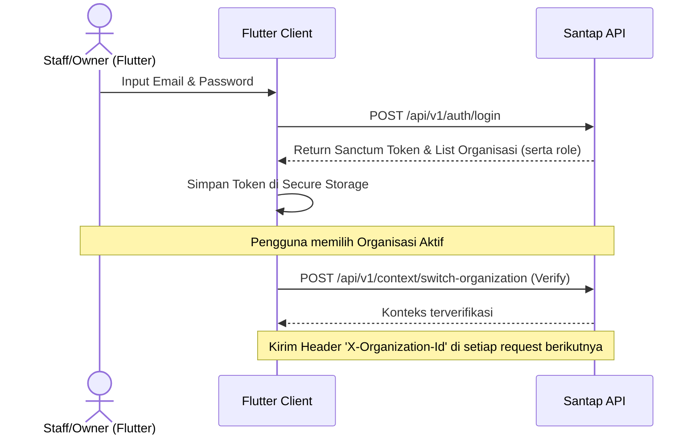
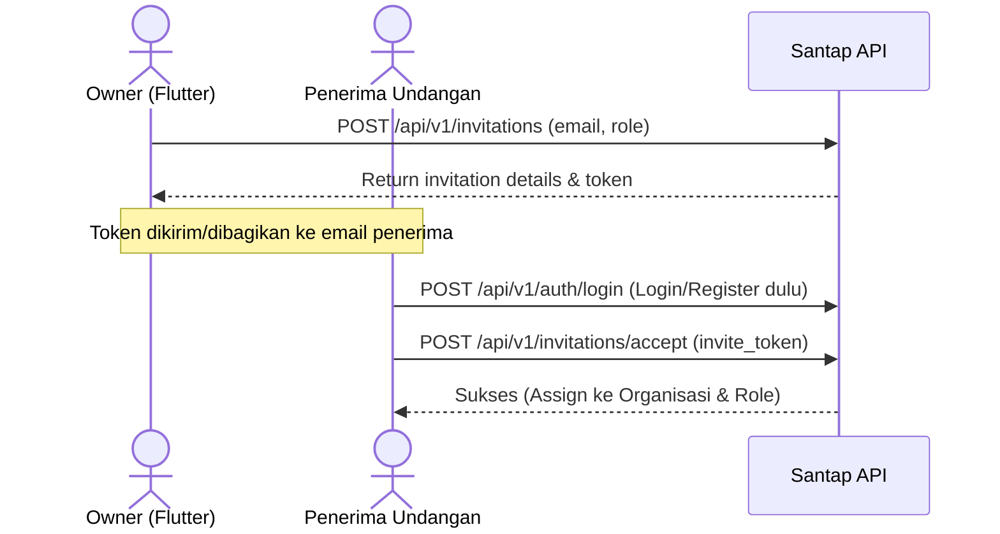
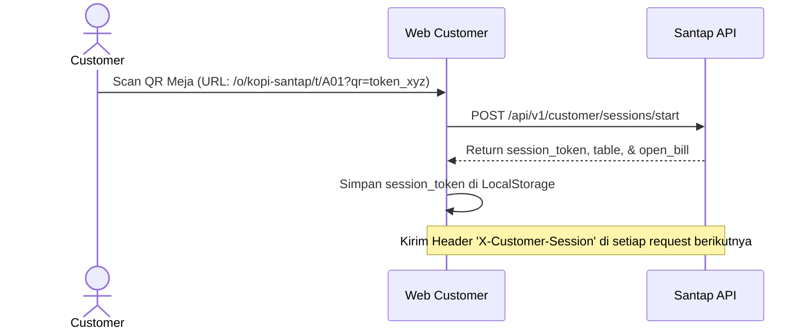
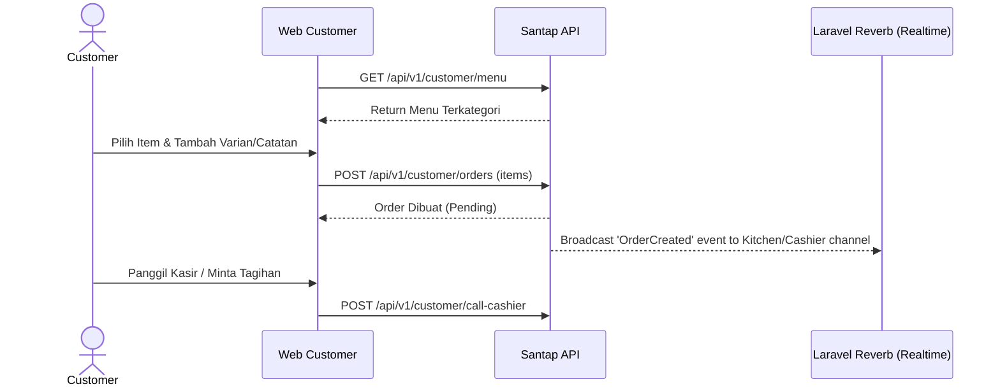
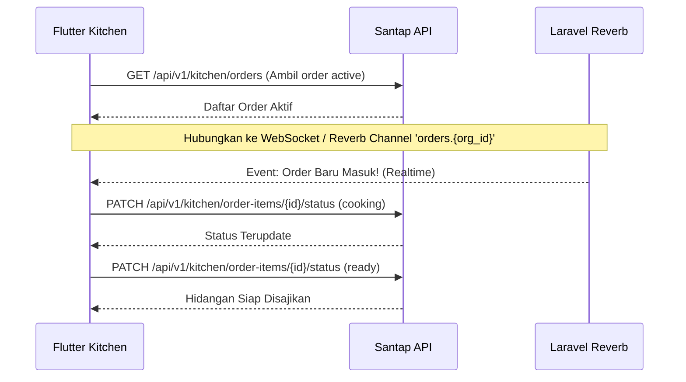
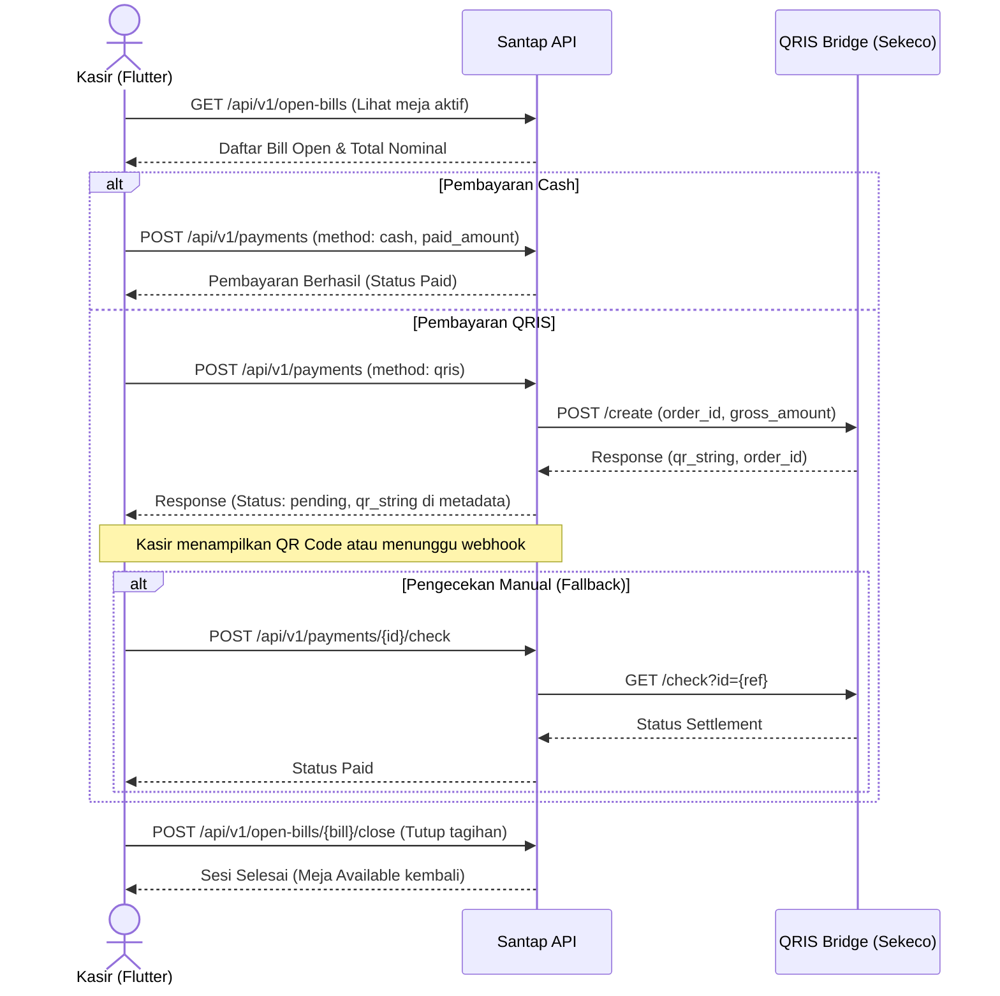

# Dokumentasi Alur API (Flutter & Web Customer)

[Indeks Santap API](../santap-api.md)

---

Dokumen ini menjelaskan alur integrasi API (API Flow) yang wajib diikuti oleh pengembang aplikasi **Flutter (untuk Staff/Owner)** dan **Web Customer (untuk Pelanggan)** saat berkomunikasi dengan Santap API.

---

## 1. Alur Autentikasi & Konteks (Aplikasi Flutter - Staff/Owner)

Aplikasi Flutter digunakan oleh Owner, Kasir, dan Kitchen. Pengguna ini harus login terlebih dahulu dan berada dalam konteks organisasi yang dipilih.



### A. Melakukan Login
* **Endpoint**: `POST /api/v1/auth/login`
* **Payload**:
  ```json
  {
    "email": "test@example.com",
    "password": "password"
  }
  ```
* **Response Sukses (200)**:
  ```json
  {
    "message": "Login berhasil.",
    "token": "3|laravel_sanctum_token_string_here...",
    "user": {
      "id": 1,
      "name": "Administrator",
      "email": "test@example.com",
      "phone": "081234567890",
      "avatar": null
    },
    "organizations": [
      {
        "id": 1,
        "uuid": "9a382e88-4fbb-4712-87ff-44e21a0cc46f",
        "name": "Kopi Santap Utama",
        "slug": "kopi-santap-utama",
        "role": "owner"
      }
    ]
  }
  ```

### B. Mengatur Konteks Organisasi
Setelah login, Flutter wajib menyimpan token Sanctum dan menggunakannya pada header `Authorization: Bearer {token}`.

Untuk berinteraksi dengan resource yang berlingkup organisasi (seperti Menu, Order, Meja), Flutter harus mengirim header:
```http
X-Organization-Id: 9a382e88-4fbb-4712-87ff-44e21a0cc46f
```
*(Bisa menggunakan ID numerik `1` atau UUID `9a382e88-4fbb-4712-87ff-44e21a0cc46f`)*.

Sebelum menyimpan pilihan organisasi, Flutter dapat melakukan verifikasi konteks dengan:
* **Endpoint**: `POST /api/v1/context/switch-organization`
* **Header**: `Authorization: Bearer {token}`
* **Payload**:
  ```json
  {
    "organization_id": "9a382e88-4fbb-4712-87ff-44e21a0cc46f"
  }
  ```

---

## 2. Alur Undangan Anggota Baru (Aplikasi Flutter - Owner)

Owner dapat mengundang anggota baru (Owner lain, Kasir, atau Kitchen) untuk bergabung ke organisasinya.



### A. Mengirim Undangan
* **Endpoint**: `POST /api/v1/invitations`
* **Header**:
  * `Authorization: Bearer {token}`
  * `X-Organization-Id: {organization_id}`
* **Payload**:
  ```json
  {
    "email": "kitchen.staff@example.com",
    "role_name": "kitchen"
  }
  ```

### B. Menerima Undangan
* **Endpoint**: `POST /api/v1/invitations/accept`
* **Header**: `Authorization: Bearer {token}` (User yang diundang harus login terlebih dahulu)
* **Payload**:
  ```json
  {
    "invite_token": "inv_abc123xyz_token"
  }
  ```

---

## 3. Alur Guest Session Pelanggan (Web Customer)

Pelanggan memesan secara mandiri dari meja dengan memindai kode QR. Pelanggan tidak perlu login (guest session).



### A. Memulai Sesi Pelanggan
* **Endpoint**: `POST /api/v1/customer/sessions/start`
* **Payload**:
  ```json
  {
    "organization_slug": "kopi-santap",
    "table_code": "A01",
    "qr_token": "token_xyz"
  }
  ```
* **Response Sukses (200)**:
  ```json
  {
    "session_token": "cust_sess_9a382e88-4fbb...",
    "organization": {
      "id": 1,
      "name": "Kopi Santap Utama",
      "slug": "kopi-santap"
    },
    "table": {
      "id": 5,
      "name": "Meja A01",
      "code": "A01"
    },
    "open_bill": {
      "id": "uuid-bill-active",
      "status": "open"
    }
  }
  ```

### B. Mengirim Request Berikutnya
Web Customer wajib melampirkan token sesi pada setiap request di header berikut:
```http
X-Customer-Session: cust_sess_9a382e88-4fbb...
```
Semua data (seperti menu dan order) akan secara otomatis tersaring (scoped) oleh backend ke organisasi dan meja terkait sesi ini.

---

## 4. Alur Pemesanan Mandiri (Web Customer)

Setelah sesi dimulai, pelanggan dapat melihat menu, melakukan pemesanan, dan melihat bill aktif meja mereka.



### A. Mengambil Menu
* **Endpoint**: `GET /api/v1/customer/menu`
* **Header**: `X-Customer-Session: {session_token}`

### B. Mengirim Order Baru
* **Endpoint**: `POST /api/v1/customer/orders`
* **Header**: `X-Customer-Session: {session_token}`
* **Payload**:
  ```json
  {
    "items": [
      {
        "menu_id": 12,
        "quantity": 2,
        "notes": "Es batu dipisah, manis sedang",
        "variants": [
          { "variant_id": 3, "value": "Less Sugar" }
        ]
      }
    ]
  }
  ```

### C. Mengambil Informasi Bill Meja Aktif
Untuk melihat riwayat pesanan meja ini yang belum dibayar:
* **Endpoint**: `GET /api/v1/customer/open-bill`
* **Header**: `X-Customer-Session: {session_token}`

---

## 5. Alur Dapur / Kitchen Board (Aplikasi Flutter - Kitchen Staff)

Kitchen Staff bertugas melihat pesanan masuk secara realtime dan memperbarui status hidangan.



### A. Mendapatkan Daftar Antrean Dapur
* **Endpoint**: `GET /api/v1/kitchen/orders`
* **Header**: 
  * `Authorization: Bearer {token}`
  * `X-Organization-Id: {organization_id}`

### B. Update Status Item Pesanan
Untuk memperbarui status item pesanan spesifik (misal dari `pending` -> `cooking` -> `ready`):
* **Endpoint**: `PATCH /api/v1/kitchen/order-items/{orderItem}/status`
* **Header**:
  * `Authorization: Bearer {token}`
  * `X-Organization-Id: {organization_id}`
* **Payload**:
  ```json
  {
    "status": "cooking" // Pilihan: pending, cooking, ready, served, cancelled
  }
  ```

---

## 6. Alur Pembayaran & Kasir (Aplikasi Flutter - Cashier)

Kasir mengelola tagihan meja (bill), memproses pembayaran dari pelanggan (baik tunai maupun QRIS online), dan menutup sesi meja.

> Catatan implementasi saat ini: API staff aktif memakai prefix `/v1/cashier/orders`.
> Open bill direpresentasikan sebagai `orders.order_type = open_bill` dan `bill_status = open`.
> Repeat order Open Bill tidak membuat row `orders` baru. Setiap submit menambah item ke order yang sama dan membuat batch baru di `order_items` dengan `batch_uuid`, `batch_number`, dan `submitted_at`.
> Detail/list order menyertakan `batch_count`, `latest_batch`, dan `item_batches` agar mobile cashier/kitchen dapat menyorot repeat order terbaru.
> Guard duplicate QRIS selalu scoped ke `orders.id` yang sedang diproses: satu order tidak boleh membuat QRIS baru saat attempt QRIS order itu masih pending, tetapi order lain tetap boleh membuat QRIS sendiri.
> Saat QRIS dibatalkan, expired, atau failed, attempt lama disimpan di `orders.metadata.qris_attempts[]`; attempt aktif tersimpan ringkas di `orders.metadata.qris_active` tanpa raw response penuh dari provider.
> Item tidak boleh ditambah, diubah, atau dihapus ketika QRIS order tersebut masih pending. Kasir harus cancel QRIS dulu, atau tunggu expired lalu regenerate.

Endpoint cashier/open bill utama:

```http
GET    /v1/cashier/orders?order_type=open_bill&bill_status=open
GET    /v1/cashier/orders/{id}
POST   /v1/cashier/orders/{id}/items
PATCH  /v1/cashier/orders/{id}/items/{itemId}
DELETE /v1/cashier/orders/{id}/items/{itemId}
POST   /v1/cashier/orders/{id}/pay-qris
GET    /v1/cashier/orders/{id}/qris-status
DELETE /v1/cashier/orders/{id}/qris-cancel
POST   /v1/cashier/orders/{id}/close
```



### A. Mengambil Daftar Bill Aktif
* **Endpoint**: `GET /api/v1/open-bills`
* **Header**:
  * `Authorization: Bearer {token}`
  * `X-Organization-Id: {organization_id}`

### B. Mencatat Pembayaran (Kasir)
* **Endpoint**: `POST /api/v1/payments`
* **Header**:
  * `Authorization: Bearer {token}`
  * `X-Organization-Id: {organization_id}`
* **Payload (Cash)**:
  ```json
  {
    "open_bill_id": "uuid-bill-active",
    "method": "cash",
    "paid_amount": 50000
  }
  ```
* **Payload (QRIS)**:
  ```json
  {
    "open_bill_id": "uuid-bill-active",
    "method": "qris"
  }
  ```
* **Response (QRIS - Pending)**:
  ```json
  {
    "message": "Pembayaran QRIS berhasil diinisiasi.",
    "data": {
      "id": "uuid-payment",
      "payment_number": "PAY-XXXXXX",
      "method": "qris",
      "status": "pending",
      "amount": 15000,
      "reference_number": "order-1779511057",
      "metadata": {
        "qr_string": "00020101021226610014COM...",
        "expiry_time": "2026-05-23 11:52:38",
        "actions": [
          { "name": "generate-qr-code", "method": "GET", "url": "..." }
        ]
      }
    }
  }
  ```

### C. Memeriksa Status Pembayaran QRIS (Kasir)
* **Endpoint**: `POST /api/v1/payments/{payment}/check`
* **Header**:
  * `Authorization: Bearer {token}`
  * `X-Organization-Id: {organization_id}`
* **Response**: Mengembalikan status pembayaran terbaru (`paid`, `pending`, atau `failed`).

### D. Membatalkan Transaksi Pembayaran QRIS (Kasir)
* **Endpoint**: `POST /api/v1/payments/{payment}/cancel`
* **Header**:
  * `Authorization: Bearer {token}`
  * `X-Organization-Id: {organization_id}`

### E. Menutup Tagihan (Close Bill)
Setelah tagihan lunas, kasir harus menutup bill agar meja menjadi kosong (`available`) dan sesi pelanggan berakhir.
* **Endpoint**: `POST /api/v1/open-bills/{bill}/close`
* **Header**:
  * `Authorization: Bearer {token}`
  * `X-Organization-Id: {organization_id}`

---

## 7. Alur Pembayaran Mandiri Pelanggan (Customer Self-Checkout)

Pelanggan dapat melakukan checkout secara mandiri langsung dari browser/smartphone mereka menggunakan QRIS.

### A. Menginisiasi Pembayaran QRIS (Pelanggan)
* **Endpoint**: `POST /api/v1/customer/payments`
* **Header**:
  * `X-Customer-Session: {session_token}`
* **Response**: Mengembalikan detail inisiasi QRIS (sama seperti response QRIS Kasir).

### B. Memeriksa Status Pembayaran QRIS (Pelanggan)
* **Endpoint**: `POST /api/v1/customer/payments/{payment}/check`
* **Header**:
  * `X-Customer-Session: {session_token}`

### C. Membatalkan Transaksi Pembayaran QRIS (Pelanggan)
* **Endpoint**: `POST /api/v1/customer/payments/{payment}/cancel`
* **Header**:
  * `X-Customer-Session: {session_token}`

### D. Integrasi Webhook Notifikasi Pembayaran (Asinkron)
Midtrans / QRIS Bridge akan memicu webhook ketika status transaksi berubah (misal pelanggan sukses melakukan transfer).
* **Endpoint**: `POST /api/v1/payments/webhook`
* **Otentikasi**: Tanpa otentikasi (Public Endpoint)
* **Payload**:
  ```json
  {
    "order_id": "order-1779511057",
    "transaction_status": "settlement",
    "gross_amount": "15000.00",
    "transaction_id": "uuid-transaction-midtrans",
    "fraud_status": "accept"
  }
  ```
